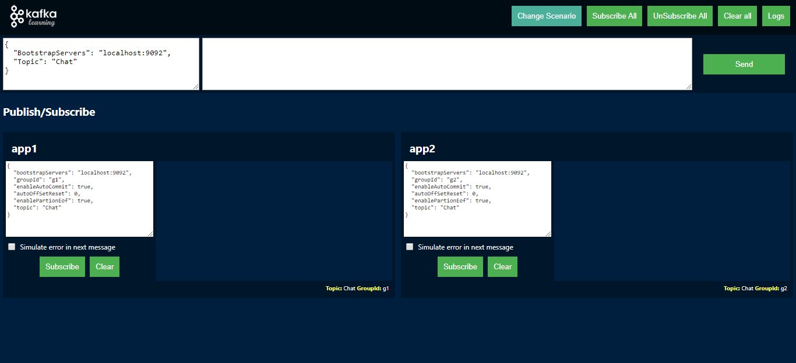
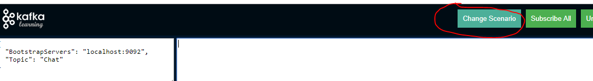

<a href="https://github.com/juniorgasparotto/KafkaLearning" rel="some text"></a>
<a href="https://github.com/juniorgasparotto/KafkaLearning/blob/master/README-PT-BR.md" rel="some text"></a>

# KafkaLearning

Esse projeto tem o objetivo de demonstrar como funciona alguns conceitos do Kafka. Por hora, temos os seguintes conceitos pre-configurados:

* `Point to Point`: Quando um produtor envia uma mensagem e apenas um consumidor fica responsável por ler a mensagem, mesmo que exista mais de um consumidor ouvindo o mesmo tópico.
* `Publish/Subscribe`: Quando um produtor envia uma mensagem e mais de um consumidor pode ler a mesma mensagem.
* `Retry`:
    * Modelo 1: A mensagem com erro é enviada para um tópico de retentativa com um delay de reprocessamento. Após o delay a mensagem volta para o tópico principal para uma nova tentativa. Após esgotado as tentativas a mensagem vai para o tópico final chamado DLQ.
    * Modelo 2: A mensagem com erro é enviada para um tópico de retentativa com um delay de reprocessamento. Após o delay a mensagem é reprocessada novamente no próprio tópico de retentativa. Após esgotado as tentativas a mensagem vai para o tópico final chamado DLQ.

## Requisitos

* .NET Core 2.1+ (.NET CLI)
* Kafka 2.11-2.2.0+
* NodeJs (npm, angular 7)
* Chrome (Com suporte a WebSocket/SignalR)

## Executando no docker

To run using docker and without installing anything on your host machine.

```
curl -sSL https://raw.githubusercontent.com/juniorgasparotto/KafkaLearning/master/src/docker-compose.yml > docker-compose.yml
docker-compose up -d
```

### Criando uma nova versão da imagem

Steps to build a new image:

```
cd /src
docker build . --tag kafka-learning:1.0
docker run -e Kafka__CertificatePath="" -e "Kafka__Producers__TopicSample__BootstrapServers=localhost:9092" -e "Kafka__Consumers__TopicSample__BootstrapServers=localhost:9092" -e ASPNETCORE_URLS="http://0.0.0.0:5000" -ti -p 5000:5000 kafka-learning:1.0
docker tag kafka-learning:1.0 juniorgasparotto/kafka-learning:latest
docker push juniorgasparotto/kafka-learning:latest
```

## Executando como desenvolvedor (LocalHost)

* Fazer o download do Kafka: https://www.apache.org/dyn/closer.cgi?path=/kafka/2.3.0/kafka_2.11-2.3.0.tgz
* Descompactar o Kafka na pasta `C:\` (ou qualquer outra pasta)
* Executar o Zookeeper usando a configuração padrão:

```
C:/kafka_2.11-2.3.0/
./bin/windows/zookeeper-server-start.bat ./config/zookeeper.properties
```

* Executar o broker do Kafka usando a configuração padrão:

```
C:/kafka_2.11-2.3.0/
./bin/windows/kafka-server-start.bat ./config/server.properties
```

* Fazer o clone desse projeto em seu local de preferência

```
git clone https://github.com/juniorgasparotto/KafkaLearning.git
```

* Abrir o terminal na raiz do código clonado
* Baixar todos os módulos do angular

```
cd src/KafkaLearning.Web/ClientApp
npm install
```

* Baixar as dependências do .NET e Build

```
cd src/KafkaLearning.Web
dotnet build
```

* Executar o projeto (o angular subirá junto)

```
cd src/KafkaLearning.Web
dotnet run
```

* Abrir no Chrome o url: https://localhost:5001. Você deve visualizar a seguinte tela:
    * Caso essa porta esteja sendo usada por outro projeto, altere-a.



* Garanta que o produtor e todos os ouvintes estejam usando a URL correta do Kafka, normalmente é "localhost:9092", mas esse projeto pode estar configurado para usar outro URL (o que utilizo no dia a dia).
* Clique no botão `Subscribe All`. O cenário padrão será o `Publish/Subscribe`
* Envia uma mensagem clicando no botão `Send` e note que a mensagem chegará nos dois ouvintes `app1` e `app2`.

## Trocar as configurações padrão (exemplo: URL padrão do Kafka)

* Ambiente de `development`:
  * .NET: Caso não seja necessário o uso de certificado (normalmente, localhost:9092 não precisa): Abra o arquivo `\src\KafkaLearning.Web\appsettings.json` e remova a configuração de certificado na propriedade: `Kafka -> CertificatePath: null`.
  * .NET: Caso seja necessário o uso de certificado: substitua o arquivo do certificado da pasta a seguir pelo seu certificado: `\src\KafkaLearning.Web\Certificates\ca.crt`. Caso você mude o nome do arquivo do certificado, altere o caminho na propriedade `CertificatePath` e garanta que esse novo arquivo esteja sendo copiado para a pasta `bin` no processo de build: `\src\KafkaLearning.Web\KafkaLearning.Web.csproj`.
  * Angular: Abra o arquivo `\src\KafkaLearning.Web\ClientApp\src\environments\environment.ts` e troque URL padrão ou qualquer outra informação.
* Ambiente de `production`:
  * .NET: Mesmo procedimento do ambiente de DEV, porém, utilize o arquivo `appsettings.production.json`.
  * Abra o arquivo `\src\KafkaLearning.Web\ClientApp\src\environments\environment.prod.ts` e troque URL padrão ou qualquer outra informação.

## Trocar de cenário

Para trocar de cenário, clique no botão `Change Scenario` e selecione o cenário desejado:




## Adicionando um novo cenário:

Outros cenários podem ser inseridos futuramente. O código está bem simples para isso, basta seguir os passos:

* Crie um componente angular na pasta `src/KafkaLearning.Web/ClientApp/src/app/scenarios`: 

```
ng g c ScenarioMyCustomTest
```

* Copie o código do componente existente `scenario-point-to-point/scenario/point-to-point.component.ts` e cole no arquivo `scenario-my-custom-test.component.ts` do novo componente, mantendo apenas o nome da classe do novo cenário.

* Altere o nome da pasta e o título do novo componente 

```typescript
  public static FOLDER: string = "scenario-my-custom-test";
  public static TITLE: string = "My custom test";
  public static TITLE_PT_BR: string = "Meu cenário customizado";
```

* Abra o arquivo de template e adicione os ouvintes com a sua configuração desejada. 
    * Mantenha a pai `<div class="subscribers">` para não quebrar o layout. 

```html
<div class="subscribers">
  <app-listener appName="app1" groupId="g1" topic="Chat" [simulateError]="false"></app-listener>
  <app-listener appName="app2" groupId="g1" topic="Chat" [simulateError]="false"></app-listener>
</div>
```

* Crie um arquivo chamado `description.html` na raiz do novo componente. Caso queira manter dois idiomas, crie o arquivo `description-pt-br.html`. Esse arquivo é HTML puro e deve conter a descrição do cenário.

* Localize o arquivo `src/KafkaLearning.Web/ClientApp/src/app/modal-scenarios/modal-scenarios.component.ts` para adicionar o cenário na modal de escolha. 

* Adicione o novo cenário no final do array `TABS`

```typescript
private static TABS: any[] = [
    { name: 'ScenarioPointToPointComponent', component: ScenarioPointToPointComponent, active: false },
    { name: 'ScenarioPublishSubscribeComponent', component: ScenarioPublishSubscribeComponent, active: false },
    { name: 'ScenarioRetryMainTopicComponent', component: ScenarioRetryMainTopicComponent, active: false },
    { name: 'ScenarioRetryNextTopicComponent', component: ScenarioRetryNextTopicComponent, active: false },
    
    // new scenario
    { name: 'ScenarioMyCustomTest', component: ScenarioMyCustomTest, active: false },
  ];
```

* Faça o build do angular com `ng build` e execute novamente o projeto.

* Pronto, seu novo componente deve aparecer na modal e já pode ser utilizado.

## Configurações do ouvinte

As configurações do componente/ouvinte `app-listener` tem uma relação direta com as configurações do `Kafka` e outras configurações de `retry` que criamos, são elas:

```html
<app-listener 
    appName="APP_NAME" 
    topic="TOPIC_NAME" 
    groupId="GROUP_ID" 
    simulateError="true|false"
    retryStrategy="retry|redirect" 
    retryTopic="RETRY_TOPIC_NAME" 
    delay="DELAY_IN_MILLISECONDS" 
    ></app-listener>
```

* `appName`: Nome da aplicação de simulação
* `topic`: Nome do tópico do `Kafka`
* `groupId`: Nome do grupo de consumo do `Kafka`
* `simulateError`: Indica se o ouvinte deve emitir um erro ou não quando ele ler uma mensagem. 
    * Dica: Cenários de erros devem sempre ser considerados em seus `Handlers`, assim como a estratégia de retry, caso necessite. 
* `retryStrategy`: Define qual será a estratégia de retry desse ouvinte/consumidor
    * `retry`: Quando definido com este valor e ocorrer um erro no consumidor, o código vai criar ou atualizar o cabeçalho `retry.count` incrementando `+1` no valor e encaminhar a mensagem para o tópico que foi definido na configuração `retryTopic`.
    * `redirect`: Quando definido com este valor o código não fará nada com a mensagem, apenas fará o redirecionamento da mensagem para o tópico que foi definido na configuração `retryTopic`.
* `retryTopic`: Tópico de destino em caso de erro ou quando a configuração `retryStrategy` for igual a `redirect`.
* `delay`: Quando definido, o consumidor criará um atraso na leitura da mensagem, isso é útil para criar retentativas exponenciais. 

OBS: Talvez o uso do valor `redirect` na configuração `retryStrategy` não faça sentido, verificar se não seria melhor criar algo como: `handler=none|redirect` e `handle-args=REDIRECT_TOPIC_NAME`.

## Instalando no OpenShift (OKD)

Antes de instalar o KafkaLearning, é necessário ter um serviço do Kafka que possa ser acessível de dentro do cluster. Ou utilize o projeto `Strimzi` para instalar um cluster Kafka dentro do seu cluster:

https://strimzi.io/quickstarts/okd/

**Links úteis:**

* https://github.com/redhat-developer/s2i-dotnetcore
* https://docs.openshift.com/container-platform/3.7/dev_guide/application_lifecycle/new_app.html

**Passo a passo da instalação:**

* Crie o secret no openshift para acessar o registry da RedHat. Você precisa de um cadastro ativo na RedHat: https://access.redhat.com/

```
oc create secret docker-registry redhat-registry \
    --docker-server=registry.redhat.io \
    --docker-username=<user> \
    --docker-password=<pwd> \
    --docker-email=<email> \
    -n openshift
```

* Instalar o ImageStream

```
oc create -f https://raw.githubusercontent.com/redhat-developer/s2i-dotnetcore/master/dotnet_imagestreams.json
```

* Ou atualize

```
oc replace -f https://raw.githubusercontent.com/redhat-developer/s2i-dotnetcore/master/dotnet_imagestreams.json
```

* Crie um projeto para conter o KafkaLearning

```
oc new-project project-kafka
```

* Ou apenas selecione um projeto no qual deseja que o contenha

```
oc project [project-name]
```

* Crie a aplicação do Kafka Learning

```
oc new-app 'dotnet:3.1~https://github.com/juniorgasparotto/KafkaLearning.git' \
--name=kafka-learning \
--context-dir src \
--build-env DOTNET_STARTUP_PROJECT=KafkaLearning.Web/KafkaLearning.Web.csproj \
--build-env DOTNET_CONFIGURATION=Release
```

* Acompanhe o log do build da imagem

```
oc logs -f bc/kafka-learning
```

* Acompanhe o log do deploy da imagem

```
oc logs -f dc/kafka-learning
```

* Expõe uma rota para conseguir acessar de fora do cluster

```
oc expose svc/kafka-learning
```

* Obtêm o endereço da rota e verifique fora do cluster se tudo está funcionando (Requested Host: <rota>)

```
oc describe route kafka-learning
```

* Para ver todos os objetos criado, utilize:

```
oc get all -l app=kafka-learning
```

* Caso queira remover o Kafka-Learning e todos os seus objetos, faça:

```
oc delete all -l app=kafka-learning
```

* Pode ser que no primeiro "Subscribe" você receba erros, isso ocorre pois todas as dependências do .NET ainda não subiram completamente.

## Melhorias

* Criar uma classe abstrata para todos os cenários para não precisar copiar o mesmo código toda vez que cria um novo cenário
* Enviar os dados do produtor para dentro do cenário
* Renomear as classes de `ConsumerClient` para `Listener` e simplificar mecanismo.
* Deixar a URL do Kafka para ser sobrescrita por uma variável de ambiente.

## Ferramentas uteis:

* http://www.kafkatool.com/download2/kafkatool.exe: Com essa ferramenta é possível visualizar todos os tópicos de um broker, além dos dados e outras informações importantes.
