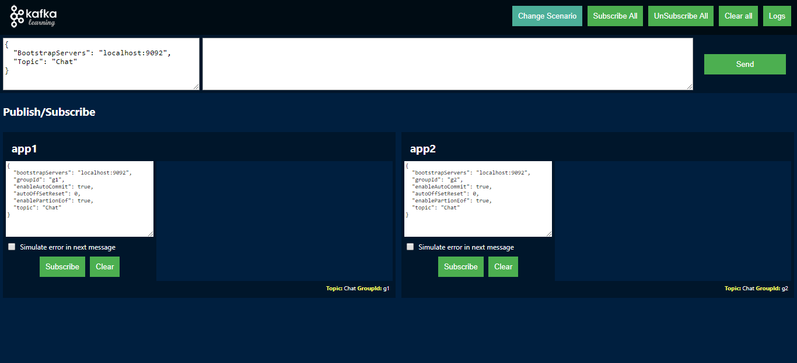
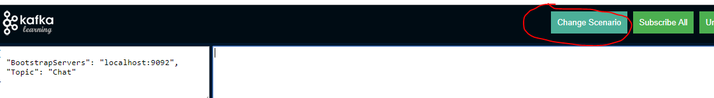
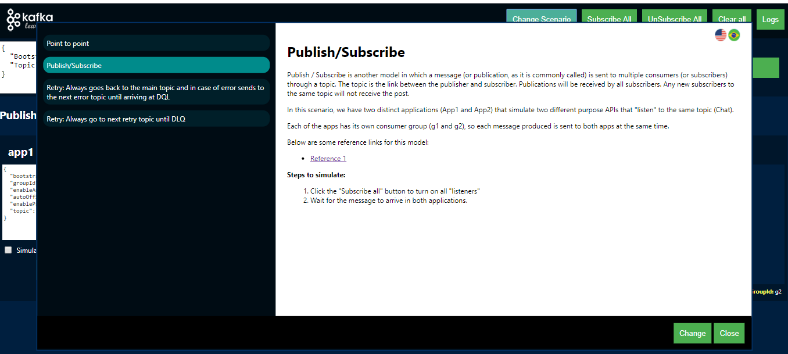

<a href="https://github.com/juniorgasparotto/KafkaLearning" rel="some text">[</a>
<a href="https://github.com/juniorgasparotto/KafkaLearning/blob/master/README-PT-BR.md" rel="some text"></a>

# KafkaLearning

This project aims to demonstrate how some Kafka concepts work. For now, we have the following preconfigured concepts:

* `Point to Point`: When a producer sends a message and only one consumer is responsible for reading the message, even if there is more than one consumer listening to the same topic.
* `Publish/Subscribe`: When a producer sends a message and more than one consumer can read the same message.
* `Retry`:
    * Model 1: The error message is sent to a retry topic with a reprocessing delay. After the delay the message returns to the main topic for a retry. After the attempts are exhausted the message goes to the final topic called DLQ.
    * Model 2: The error message is sent to a retry topic with a reprocessing delay. After the delay the message is reprocessed again in the retry topic itself. After the attempts are exhausted the message goes to the final topic called DLQ.

## Requirements

* .NET Core 2.1+ (.NET CLI)
* Kafka 2.11-2.2.0+
* NodeJs (npm, angular 7)
* Chrome (With WebSocket / SignalR Support)

## Running

* Download Kafka: https://www.apache.org/dyn/closer.cgi?path=/kafka/2.3.0/kafka_2.11-2.3.0.tgz
* Unzip Kafka in the `C:\` folder (or any other folder)
* Run Zookeeper using the default setting:

```
C:/kafka_2.11-2.3.0/bin/windows/zookeeper-server-start.bat C:/kafka_2.11-2.3.0/config/zookeeper.properties
```

* Run Kafka broker using the default setting:

```
C:/kafka_2.11-2.3.0/bin/windows/kafka-server-start.bat C:/kafka_2.11-2.3.0/config/server.properties
```

* Clone this project to your preferred location

```
git clone https://github.com/juniorgasparotto/KafkaLearning.git
```

* Open terminal at root of cloned code
* Download all angular modules

```
cd src/KafkaLearning.Web/ClientApp
npm install
```

* Download .NET and Build Dependencies

```
cd src/KafkaLearning.Web
dotnet build
```

* Run the project (the angle will go up together)

```
cd src/KafkaLearning.Web
dotnet run
```

* Open in Chrome the url: https://localhost:5001. You should see the following screen:
    * If this port is being used by another project, change it.



* Click on the `Subscribe All` button. The default scenario will be `Publish / Subscribe`
* Send a message by clicking the `Send` button and note that the message will arrive at both the` app1` and `app2` listeners.

## Change scenery

To switch scenarios, click on the `Change Scenario` button and select the desired scenario:





## Adding a new scenario:

Other scenarios may be inserted in the future. The code is very simple for that, just follow the steps:

* Create an angular component in the folder `src/KafkaLearning.Web/ClientApp/src/app/scenarios`: 

```
ng g c ScenarioMyCustomTest
```

* Copy existing component code `scenario-point-to-point/scenario/point-to-point.component.ts` and paste in the file `scenario-my-custom-test.component.ts` of the new component, keeping only the class name of the new scenario.

* Change folder name and new component title

```typescript
  public static FOLDER: string = "scenario-my-custom-test";
  public static TITLE: string = "My custom test";
  public static TITLE_PT_BR: string = "Meu cenário customizado";
```

* Open the template file and add the listeners with your desired setting.
    * Keep the parent `<div class="subscribers">` so as not to break the layout.

```html
<div class="subscribers">
  <app-listener appName="app1" groupId="g1" topic="Chat" [simulateError]="false"></app-listener>
  <app-listener appName="app2" groupId="g1" topic="Chat" [simulateError]="false"></app-listener>
</div>
```

* Create a file named `description.html` in the root of the new component. If you want to keep two languages, create the `description-pt-br.html` file. This file is pure HTML and must contain the description of the scenario.

* Locate the file `src/KafkaLearning.Web/ClientApp/src/app/modal-scenarios/modal-scenarios.component.ts` to add the scenario in the modal of choice.

* Add new scenario at end of `TABS` array

```typescript
private static TABS: any[] = [
    { component: ScenarioPointToPointComponent, active: false },
    { component: ScenarioPublishSubscribeComponent, active: false },
    { component: ScenarioRetryMainTopicComponent, active: false },
    { component: ScenarioRetryNextTopicComponent, active: false },
    
    { component: ScenarioMyCustomTest, active: false },
    //  ^^^^^

  ];
```

* Build the angular with `ng build` and rerun the project.

* There, your new component should appear in modal and can now be used.

## Listener Settings

The `app-listener` component/listener settings have a direct relationship to the` Kafka` settings and other `retry` settings we have created, they are:

```html
<app-listener 
    appName="APP_NAME" 
    topic="TOPIC_NAME" 
    groupId="GROUP_ID" 
    simulateError="true|false"
    retryStrategy="retry|redirect" 
    retryTopic="RETRY_TOPIC_NAME" 
    delay="DELAY_IN_MILLISECONDS" 
    ></app-listener>
```

* `appName`: Simulation App Name
* `topic`: Kafka Topic Name
* `groupId`: Kafka Consumer Group Name
* `simulateError`: Indicates whether or not the listener should issue an error when reading a message.
    * Tip: Error scenarios should always be considered in your `Handlers`, as well as the retry strategy if you need to.
* `retryStrategy`: Defines what this listener / consumer retry strategy will be
    * `retry`: When set to this value and a consumer error occurs, the code will create or update the `retry.count` header by incrementing` + 1` in the value and forwarding the message to the topic that was set in the `retryTopic` setting.
    * `redirect`: When set to this value the code will do nothing with the message, it will only redirect the message to the topic that was set in the `retryTopic` setting.
* `retryTopic`: Destination topic on error or when setting `retryStrategy` equals` redirect`.
* `delay`: When set, the consumer will create a delay in reading the message, which is useful for creating exponential retries.

NOTE: Maybe using the `redirect` value in the` retryStrategy` setting does not make sense, check if it would be better to create something like: `handler=none|redirect` and` handle-args=REDIRECT_TOPIC_NAME`.

## Improvements

* Create an abstract class for all scenarios so you don't have to copy the same code every time you create a new scenario
* Send producer data into scenario
* Rename the classes from `ConsumerClient` to` Listener` and simplify mechanism.

## Useful tools:

* http://www.kafkatool.com/download2/kafkatool.exe: With this tool you can view all topics of a broker, as well as data and other important information.